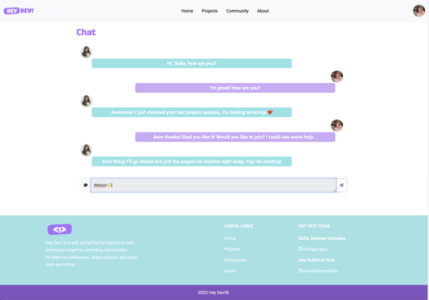

Hey Dev! is a web portal that brings junior web developers together, providing oportunities for them to collaborate, share projects and learn from eachother.
 
Once you have created and account, you will be able to edit your profile, create a new projects for others to join, join other juniors' projects, check other developers profiles and projects, chat with toher users, and so much more! ✨

Tech info: Back-end Framework + full-stack app with users full CRUD.
 
Main technologies used: JavaScript, HTML, CSS, Bootstrap, ExpressJS, NodeJS, HBS, MongoDB, Cloudinary.
 
Oh, and its design is full responsive.

 
 

<h2>Gallery</h2>

Landing page

Projects list, search menu and project detail

Community

About us

Login and signup pages

Profile view and update form

Chat and messages between users

Error pages

